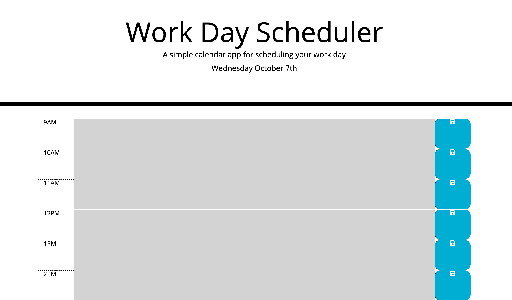
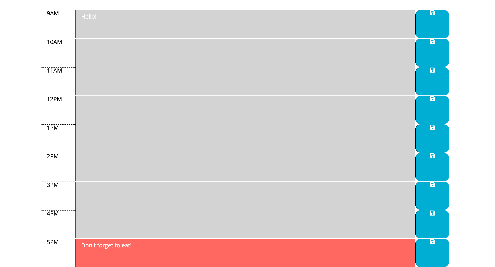

# daily-planner

This webpage allows any user who has access to it to use a daily scheduler to input an hour by hour meetings, calls, etc. The user will know visually, at a quick glance, where they are in their day based off a coloring system. If the time is in the past, then the row will be grey, if the time is in the current hour the row will be red and finally, if the time is in the future then the row will be green. 

This application was the easiest of the Javascript assignments. There were two parts that were difficult for me and they were the last two keys aspects of the assignment. The first was getting the CSS coloring in the rows to line up with my if/else statements. The first thing I had to do add a moment.js time frame with a 24h military time setting and then go back to my array of time and change the timeNumbers to be a continous number and not a standard clock number system. 

The second issue I had was setting up my local storage. After speaking with my tutor, I set up my event listener so that my id's in my save button would be modified into the same id as my textarea and therefore save it in the local storage. What caused me the most issue was getting the user input to stay on the page after refreshed. After speaking to another tutor and a friend, I came to the realization that I needed to include my local storage in my for loop.

## Installation

Fork repository at [gstephbolivar github](https://github.com/gstephbolivar/daily-planner) .

Clone repository to local terminal.

Open HTML then open webpage to default browser.

Happy editing!

## Usage

This [website] (https://gstephbolivar.github.io/daily-planner/)allows a user to have a daily planner in which they can add, replace and erase information. It also allows the user to know what time they are in. If the time is in the past then the row will be grey, if the time is in the current hour then the row will be red and if the time is in the future then the row will be green. 

## Credits

I credit the following people/websites: 

[Manuela] (https://github.com/manucaicedo) for general knowledge and guidance. 

[StackOverflow] (https://stackoverflow.com/questions/415602/set-value-of-textarea-in-jquery) Guidance on my local storage syntax. 

[StackOverflow] (https://stackoverflow.com/questions/10398931/how-to-remove-text-from-a-string) Guidance on taking out the text from string to help my local storage value. 

[FontAwesome] (https://fontawesome.com/icons/save?style=solid) For the save favicon.

[StackOverflow] (https://stackoverflow.com/questions/12970284/moment-js-24h-format) Setting a 24h format from moment.js

####  **Stephany Bolivar** 
*  **Github:** [@gstephbolivar](https://github.com/gstephbolivar)
*  **Email:** [g.stephanybolivar@gmail.com](g.stephanybolivar@gmail.com)

## License

MIT License

Copyright (c) [2020] [Gloria Stephany Bolivar]

Permission is hereby granted, free of charge, to any person obtaining a copy
of this software and associated documentation files (the "Software"), to deal
in the Software without restriction, including without limitation the rights
to use, copy, modify, merge, publish, distribute, sublicense, and/or sell
copies of the Software, and to permit persons to whom the Software is
furnished to do so, subject to the following conditions:

The above copyright notice and this permission notice shall be included in all
copies or substantial portions of the Software.

THE SOFTWARE IS PROVIDED "AS IS", WITHOUT WARRANTY OF ANY KIND, EXPRESS OR
IMPLIED, INCLUDING BUT NOT LIMITED TO THE WARRANTIES OF MERCHANTABILITY,
FITNESS FOR A PARTICULAR PURPOSE AND NONINFRINGEMENT. IN NO EVENT SHALL THE
AUTHORS OR COPYRIGHT HOLDERS BE LIABLE FOR ANY CLAIM, DAMAGES OR OTHER
LIABILITY, WHETHER IN AN ACTION OF CONTRACT, TORT OR OTHERWISE, ARISING FROM,
OUT OF OR IN CONNECTION WITH THE SOFTWARE OR THE USE OR OTHER DEALINGS IN THE
SOFTWARE.